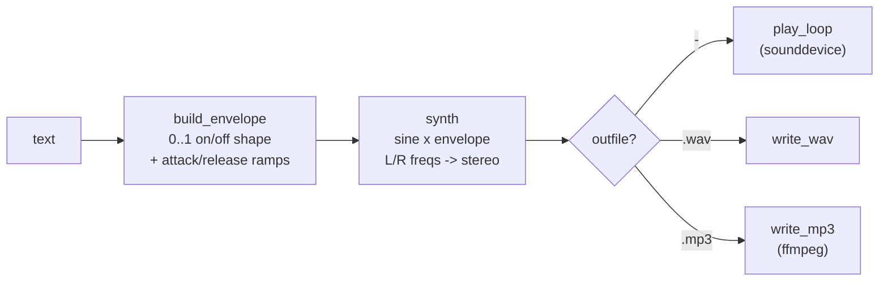
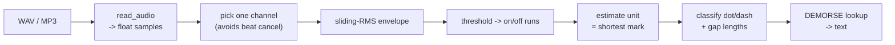
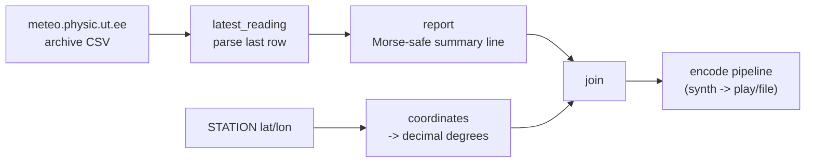
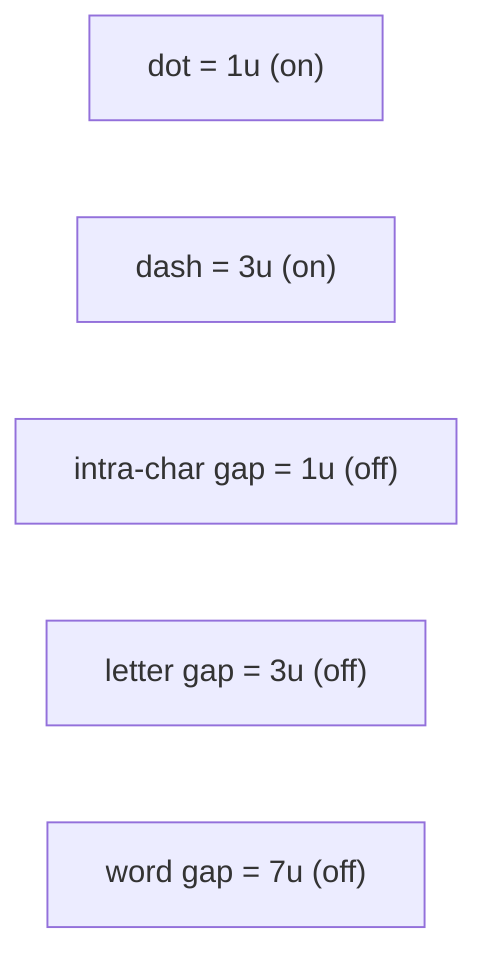

# morse

Synthesize text into Morse code audio (WAV/MP3 or live playback), decode Morse
audio back into text, and broadcast live Tartu weather as Morse.

## Install

```bash
uv sync
```

MP3 read/write needs [`ffmpeg`](https://ffmpeg.org/) on `PATH`. WAV and live
playback work without it.

## Usage

### Encode — text → audio

```bash
uv run morse "SOS OVER" out.wav      # write WAV
uv run morse "SOS OVER" out.mp3      # write MP3 (needs ffmpeg)
uv run morse "SOS OVER"              # play live, press q to quit
uv run morse "HELLO" out.wav 3       # 3 repeats in the file
```

Positional args: `message` `outfile` `loops`. `outfile` of `-` (the default)
plays live instead of writing.

| Flag | Default | Meaning |
|------|---------|---------|
| `--unit` | `0.10` | dot length in seconds (lower = faster) |
| `--attack` / `--release` | `0.008` | per-mark fade in/out (seconds), kills clicks |
| `--vol` | `0.20` | amplitude 0..1 |
| `--left` / `--right` | `600` / `615` | left/right tone Hz; the difference is a binaural beat |
| `--sr` | `48000` | sample rate |
| `--bitrate` | `128k` | MP3 bitrate |

### Decode — audio → text

```bash
uv run morse decode out.wav      # -> SOS OVER
uv run morse decode out.mp3
```

| Flag | Default | Meaning |
|------|---------|---------|
| `--threshold` | `0.5` | fraction of peak amplitude counted as "tone on" |
| `--window` | `0.005` | RMS smoothing window in seconds |

The decoder is self-calibrating: it estimates the dot length from the signal,
so it handles any speed without being told the WPM. Tuned for synthesized /
clean tones — noisy microphone recordings are not handled yet.

### Weather broadcast — Tartu weather → Morse

Fetches the latest reading from [meteo.physic.ut.ee](https://meteo.physic.ut.ee)
and keys it out as Morse. Same tone flags and outfile/loops as `encode`.

```bash
uv run morse weather              # play the report live
uv run morse weather wx.wav 1     # write it to a file
```

Example report (printed to stderr, then broadcast):

```
WX TARTU 1630Z TEMP 21 HUM 52 PRES 1014 WIND 5 MS NW LAT 58.3664 N LON 26.6907 E
```

Time is station local, temp °C (`MINUS` prefix below zero), humidity %, pressure
hPa, wind m/s + 8-point cardinal, `RAIN` when precipitating, then the station
position in decimal degrees. The table includes `.` and `,`, so it round-trips
through `decode`.

### As a library

```python
from morse import synth, write_wav, read_audio, decode, weather_report

audio = synth("SOS", 48000, 0.1, 0.008, 0.008, 0.2, 600, 615)
write_wav("out.wav", audio, 48000)

audio, sr = read_audio("out.wav")
print(decode(audio, sr))   # -> SOS

print(weather_report())    # -> WX TARTU 1630Z TEMP 21 HUM 52 ...
```

## How it works

### Encode pipeline



### Decode pipeline



### Weather broadcast



### Morse timing

Everything is multiples of one `unit` (the dot length):



## Module layout

```
src/morse/
  table.py      MORSE + DEMORSE lookup maps
  synth.py      build_envelope, synth  (text -> audio)
  output.py     to_pcm16, write_wav, write_mp3
  loader.py     read_audio  (WAV native, MP3 via ffmpeg)
  decode.py     decode  (audio -> text)
  playback.py   play_loop  (live, press q)
  weather.py    fetch + summarize Tartu weather (stdlib urllib)
  cli.py        encode / decode / weather subcommands
tests/
  test_roundtrip.py   synth -> decode -> text
```

## Test

```bash
uv run python tests/test_roundtrip.py    # or: uv run pytest
```
